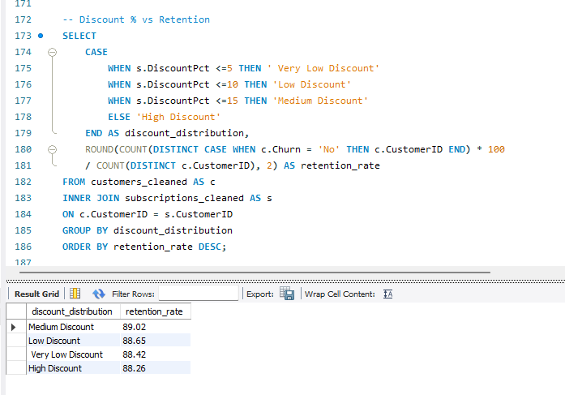

<h1>📊 Project Title</h1>
<h2>Customer Churn & Retention Analytics</h2>

<h1>📋 Project Overview</h1>

This project analyzes customer churn & retention for a subscription-based digital service company. The objective is to identify the key factors influencing customer churn by analyzing customer behavior, subscription details, customer satisfaction, engagement, and support interactions.

The analysis focuses on identifying high risk customer-segment, understanding the relationship between customer engagement and churn, and evaluating how subscription and support-related factors influence retention.

<h1>🎯 Business Problem</h1>

The company is experiencing customer churn in it's subscription-based services, resulting in the loss of recurring revenue and making customer retention a growing business concern. However, management currently lacks a clear understanding of why customer churn and which customer segment are most at risk.

The business has customer, subscriptions, and support-ticket data containing information about subscriptions plans, contract types, monthly usage, customer tenure, login activity, satisfaction score, auto-renewal preferences discounts and support interactions.

The ultimate goal is to provide data-driven insights and actionable recommendations that can help the company identify high-risk customer, improve customer engagement, optimize subscription strategies, and increase overall customer retention.

<h2>Business Objectives</h2>
<ol>
  <li>Measure overall customer churn and identify major churn patterns.</li>
  <li>Identify high-risk customer segment based on plan, country, age, tenure, usage, satisfaction.</li>
  <li>Analyze subscription behavior to determine which contract types and plans have better retention.</li>
  <li>Evaluate customer engagement by analyzing login recency and monthly usage.</li>
</ol>

<h1>🛠️ Tools Used</h1>
<ul>
  <li>SQL (Data Analysis)</li>
  <li>Python (Pandas) (Data Cleaning)</li>
  <li>Power BI (Dashboard Development)</li>
</ul>

<h1>📈 Key KPIs</h1>
<ol>
  <li>Total Customers</li>
  <li>Churned Customers</li>
  <li>Churn Rate %</li>
  <li>Retention Rate %</li>
  <li>Average Satisfaction</li>
</ol>

<h1>🔍 SQL Analysis</h1>

What is the overall customer Churn Rate?

Which contract type generates better customer retention?

Do customer with lower monthly usage churn rate more frequently?

How does the level of discount offered to customers affect their retention rate?

<h1>📷 Dashboard Preview</h1>

<h1>💡 Key Insights</h1>
<ol>
  <li>Low-usage customers recorded a <b>26.97% churn rate </b>, compared with <b>8.01% for high-usage customer</b></li>
  <li>Customers inactive for <b>90+ days had a 12.47% of churn rate</b>, highlighting the need for re-engagement strategies.</li>
  <li>Lower satisfaction scores were associated with significantly higher churn, emphasizing the importance of customer experience.</li>
  <li>Churn remained relatively consistent across <b>plans & contract types</b>, indicating that customer behavior may be a stronger churn indicator.</li>
  <li><b>Bug issues generated the highest support volume (4,208), </b> while Login issues had the longest average resolutions time at a <b>7.68 days</b></li>
</ol>

<h1>🚀 Recommendations</h1>
<ol>
  <li>Implement targeted re-engagement campaign for low-usage and inactive customers.</li>
  <li>Strengthen onboarding and engagement initiatives to increase the product usage.</li>
  <li>Proactively address low-satisfaction customers through feedback and personalized support.</li>
  <li>Prioritized high-volume technical issue and reduce support resolution times.</li>
  <li>Used targeted rather than board discounts and evaluate their impact on retention and revenue.</li>
</ol>
